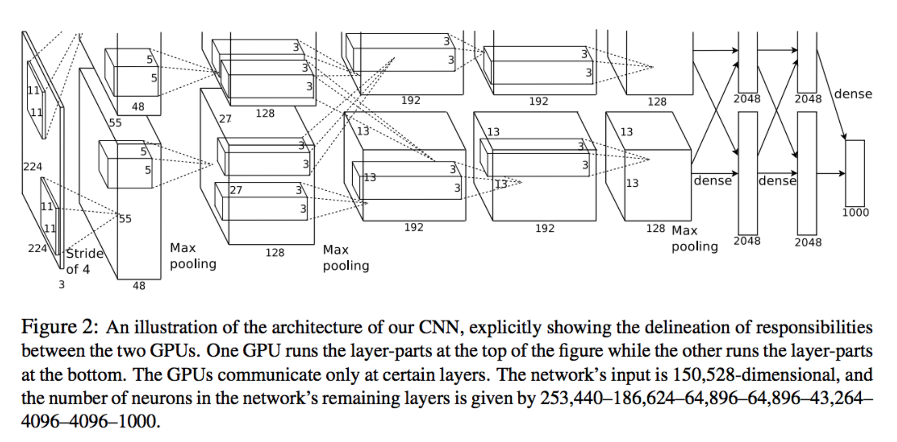
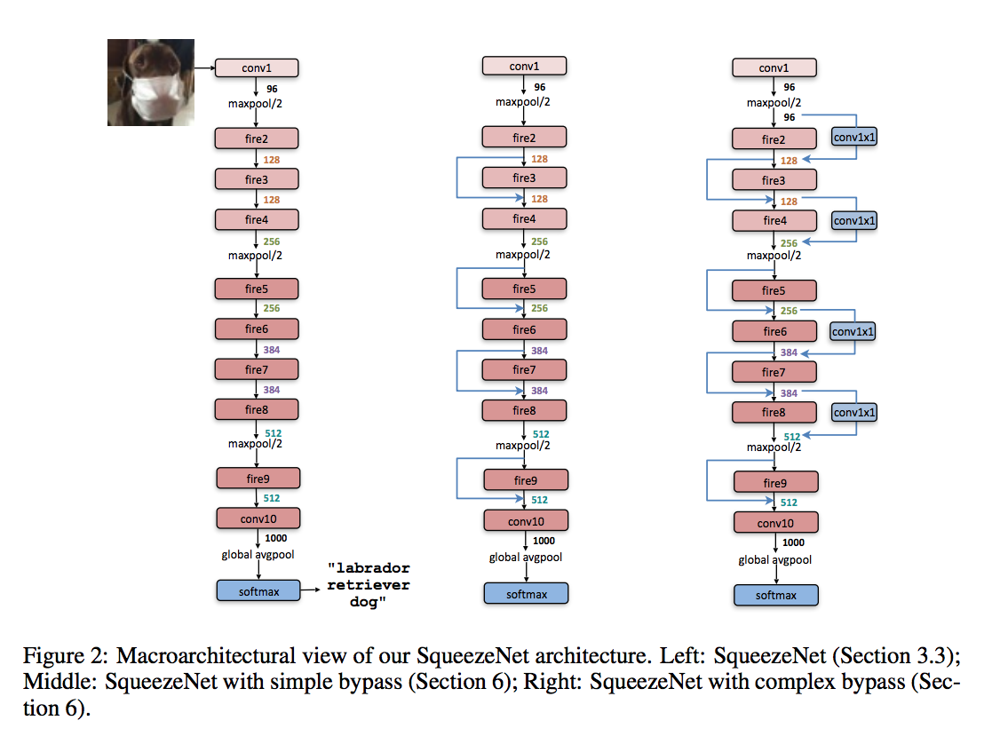
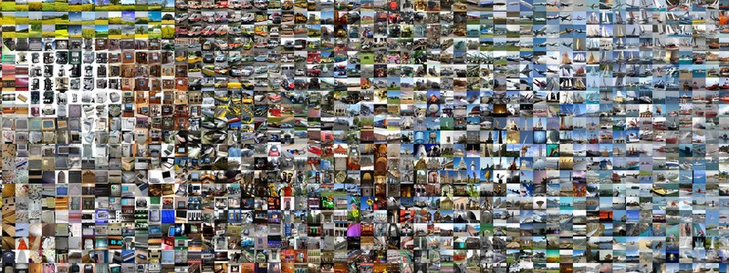
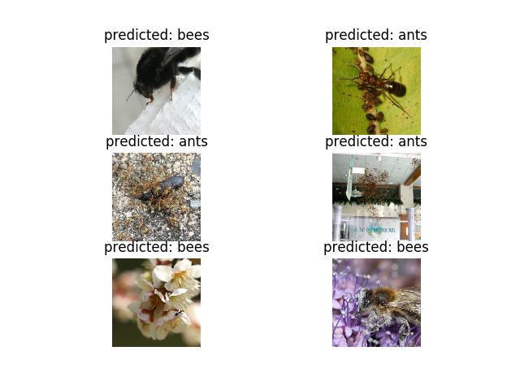

# Traning and Transfer Learning ImageNet model in Pytorch

This project implements:
- [Training](#imagenet-training-in-pytorch) of popular model architectures, such as ResNet, AlexNet, and VGG on the ImageNet dataset;
- [Transfer learning](#transfer-learning) from the most popular model architectures of above, fine tuning only the last fully connected layer.

*Note*:

- **ImageNet training** will be documeted in the next release.
- **Transfer-learning** was fully tested on alexnet, densenet121, inception_v3, resnet18 and vgg19. The other models will be tested in the next release.

## Usage

```bash
usage: main.py [-h] [--data DIR] [--outf OUTF] [--evalf EVALF] [--arch ARCH]
               [-j N] [--epochs N] [--start-epoch N] [-b N] [--lr LR]
               [--momentum M] [--weight-decay W] [--print-freq N]
               [--resume PATH] [-e] [--train] [--test] [-t] [--pretrained]
               [--world-size WORLD_SIZE] [--dist-url DIST_URL]
               [--dist-backend DIST_BACKEND]

PyTorch ImageNet Training

optional arguments:
  -h, --help            show this help message and exit
  --data DIR            path to dataset
  --outf OUTF           folder to output model checkpoints
  --evalf EVALF         path to evaluate sample
  --arch ARCH, -a ARCH  model architecture: alexnet | densenet121 |
                        densenet161 | densenet169 | densenet201 | inception_v3
                        | resnet101 | resnet152 | resnet18 | resnet34 |
                        resnet50 | squeezenet1_0 | squeezenet1_1 | vgg11 |
                        vgg11_bn | vgg13 | vgg13_bn | vgg16 | vgg16_bn | vgg19
                        | vgg19_bn (default: resnet18)
  -j N, --workers N     number of data loading workers (default: 4)
  --epochs N            number of total epochs to run
  --start-epoch N       manual epoch number (useful on restarts)
  -b N, --batch-size N  mini-batch size (default: 256)
  --lr LR, --learning-rate LR
                        initial learning rate
  --momentum M          momentum
  --weight-decay W, --wd W
                        weight decay (default: 1e-4)
  --print-freq N, -p N  print frequency (default: 10)
  --resume PATH         path to latest checkpoint (default: none)
  -e, --evaluate        evaluate model on validation set
  --train               train the model
  --test                test a [pre]trained model on new images
  -t, --fine-tuning
                        transfer learning enabled + fine tuning - train only the last FC
                        layer.
  --pretrained          use pre-trained model
  --world-size WORLD_SIZE
                        number of distributed processes
  --dist-url DIST_URL   url used to set up distributed training
  --dist-backend DIST_BACKEND
                        distributed backend
```


## ImageNet models Architecture

#### alexnet



Credit: [Imagenet classification with deep convolutional neural networks paper](https://papers.nips.cc/paper/4824-imagenet-classification-with-deep-convolutional-neural-networks.pdf)

#### densenet


Credit: [Densely Connected Convolutional Networks](https://arxiv.org/pdf/1608.06993.pdf)

#### inception_v3


Credit: [Rethinking the Inception Architecture for Computer Vision paper](https://arxiv.org/pdf/1512.00567.pdf) (image taken from [google research blog](https://research.googleblog.com/2016/08/improving-inception-and-image.html))

#### resnet34


Credit: [Deep Residual Learning for Image Recognition paper](https://arxiv.org/pdf/1512.03385v1.pdf)

#### squeezenet1_0



Credit: [Squeezenet: Alexnet-level accuracy with 50x fewer parameters and <0.5MB model size](https://arxiv.org/pdf/1602.07360.pdf)

#### vgg19net


Credit: [Very Deep Convolutional Networks For Large-Scale Image Recognition paper](https://arxiv.org/pdf/1409.1556v6.pdf) (image taken from Resnet paper)

## ImageNet training in PyTorch



*Credit: [karpathy.github.io](http://karpathy.github.io/2014/09/02/what-i-learned-from-competing-against-a-convnet-on-imagenet/)*

This project implements the ImageNet classification task on [ImageNet](http://www.image-net.org/) dataset with different famous Convolutional Neural Network(CNN or ConvNet) models. This is a porting of [pytorch/examples/imagenet](https://github.com/pytorch/examples/tree/master/imagenet) making it usables on [FloydHub](https://www.floydhub.com).

### Requirement

Download the ImageNet dataset and move validation images to labeled subfolders. Unfortunately at the moment the imagenet is not fully supported as [torchvision.dataset](http://pytorch.org/docs/master/torchvision/datasets.html#imagenet-12), so we need to use the [ImageFolder API](http://pytorch.org/docs/master/torchvision/datasets.html#imagefolder) which expects to load the dataset from a structure of this type:

```bash
ls /dataset

train
val
test

# Train
ls /dataset/train
cat
dog
tiger
plane
...

ls /dataset/train/cat
cat01.png
cat02.png
...

ls /dataset/train/dog
dog01.jpg
dog02.jpg
...
...[others classification folders]

# Val
ls /dataset/val
cat
dog
tiger
plane
...

ls /dataset/val/cat
cat01.png
cat02.png
...

ls /dataset/val/dog
dog01.jpg
dog02.jpg
...

# Test
ls /dataset/test
images

ls /dataset/test/images
test01.png
test02.png
...

```

Once you have build the dataset following the steps above, upload it as FloydHub dataset following this guide: [create and upload FloydHub dataset](https://docs.floydhub.com/guides/create_and_upload_dataset/).

### Run on FloydHub

Here's the commands to train and evaluate your [pretrained] model on FloydHub(these section will be improved with the next release):

#### Project Setup

Before you start, log in on FloydHub with the [floyd login](http://docs.floydhub.com/commands/login/) command, then fork and init
the project:

```bash
$ git clone https://github.com/ReDeiPirati/imagenet.git
$ cd imagenet
$ floyd init imagenet
```

#### Training

To train a model, run `main.py` with the desired model architecture and the path to the ImageNet dataset:

```bash
floyd run --gpu --data <your_user_name>/datasets/imagenet/<version>:input "python main.py -a resnet18 [other params]"
```

The default learning rate schedule starts at 0.1 and decays by a factor of 10 every 30 epochs. This is appropriate for ResNet and models with batch normalization, but too high for AlexNet and VGG. Use 0.01 as the initial learning rate for AlexNet or VGG:

```bash
floyd run --gpu --data <your_user_name>/datasets/imagenet/<version>:input "python main.py -a alexnet --lr 0.01 [other params]"
```

**Note**:

A full training on Imagenet *can takes weeks* according to the selected model.

#### Evaluating & Serving

*Soon.*

## Transfer Learning



This project implements the a Transfer Learning classification task on the [Bees Vs Ants](https://download.pytorch.org/tutorial/hymenoptera_data.zip) toy dataset(train: 124 images of ants and 121 images of bees, val: 70 images of ants and 83 images of bees) with different Convolutional Neural Network(CNN or ConvNet) models. This is a porting of the [transfer learning tutorial from the official PyTorch Docs](http://pytorch.org/tutorials/beginner/transfer_learning_tutorial.html) making it usables on [FloydHub](https://www.floydhub.com).

Credit: [Sasank Chilamkurthy](https://chsasank.github.io/) who has written the amazing tutorial on transfer learning in the PyTorch docs.

### Run on FloydHub

Here's the commands to train and evaluate your [pretrained] model on FloydHub(these section will be improved with the next release):


#### Project Setup

Before you start, log in on FloydHub with the [floyd login](http://docs.floydhub.com/commands/login/) command, then fork and init
the project:

```bash
$ git clone https://github.com/ReDeiPirati/imagenet.git
$ cd imagenet
$ floyd init imagenet
```

#### Training

I have already uploaded it as FloydHub dataset so that you can try and familiarize with `--data` parameter which mounts the specified volume(datasets/model) inside the container of your FloydHub instance. Now it's time to run our training on FloydHub. In this example we will train the model for 10 epochs with a gpu instance.
**Note**: If you want to mount/create a dataset [look at the docs](https://docs.floydhub.com/guides/create_and_upload_dataset/).

```bash
floyd run --gpu --env pytorch-0.2 --data redeipirati/datasets/pytorch-hymenoptera/1:input "python main.py -a resnet18 --train --fine-tuning --pretrained --epochs 10 -b 4"
```

Note:

- `--gpu` run your job on a FloydHub GPU instance
- `--env pytorch-0.2` prepares a pytorch environment for python 3.
- `--data redeipirati/datasets/pytorch-hymenoptera/1` mounts the pytorch hymenoptera dataset(bees vs ants) in the /input folder inside the container for our job so that we do not need to dowload it at training time.

#### Evaluating

It's time to evaluate our model with some images:
```bash
floyd run --gpu --env pytorch-0.2 --data redeipirati/datasets/pytorch-hymenoptera/1:input --data <REPLACE_WITH_JOB_OUTPUT_NAME>:model "python main.py -a resnet18 --test --fine-tuning  --evalf test/ --resume /model/model_best.pth.tar"
```

Notes:

- I've prepared for you some images in the test folder that you can use to evaluate your model. Feel free to add on it a bunch of bee/ant images downloaded from the web.
- Remember to evaluate images which are taken from a similar distribution, otherwise you will have bad performance due to distribution mismatch.

#### Try our pre-trained model
We have provided to you a pre-trained model trained for 30 epochs with an accuracy of about 95%.

```bash
floyd run --gpu --env pytorch-0.2 --data redeipirati/datasets/pytorch-hymenoptera/1:input --data <REPLACE_WITH_JOB_OUTPUT_NAME>:model "python main.py -a resnet18 --test --fine-tuning  --evalf test/ --resume /model/model_best.pth.tar"
```

#### Serving

FloydHub supports seving mode for demo and testing purpose. Before serving your model through REST API, you need to create a `floyd_requirements.txt` and declare the flask requirement in it. If you run a job with `--mode` serve flag, FloydHub will run the app.py file in your project and attach it to a dynamic service endpoint:

```bash
floyd run --gpu --mode serve --env pytorch-0.2  --data redeipirati/datasets/pytorch-hymenoptera/1:input --data <REPLACE_WITH_JOB_OUTPUT_NAME>:model
```

Note:
The script retrieve the number of class from the dataset `--data redeipirati/datasets/pytorch-hymenoptera/1`. This behavior will be fixed in the next release.

The above command will print out a service endpoint for this job in your terminal console.

The service endpoint will take a couple minutes to become ready. Once it's up, you can interact with the model by sending an images(of ant or bee) file with a POST request that the model will classify:

```bash
# Template
# curl -X POST -F "file=@<ANT_OR_BEE>" <SERVICE_ENDPOINT>

# e.g. of a POST req
curl -X POST -F "file=@./test/images/test01.png"  https://www.floydlabs.com/expose/BhZCFAKom6Z8RptVKskHZW
```

Any job running in serving mode will stay up until it reaches maximum runtime. So once you are done testing, **remember to shutdown the job!**

*Note that this feature is in preview mode and is not production ready yet*

## More resources

Some useful resources on ImageNet and the famous ConvNet models:

- [ILSVRC(Imagenet Large Scale Visual Recognition Challenge)](http://www.image-net.org/challenges/LSVRC/)
- [Karpathy CNN and ImageNet](http://karpathy.github.io/2014/09/02/what-i-learned-from-competing-against-a-convnet-on-imagenet/)
- [CS231n CNN](http://cs231n.github.io/convolutional-networks/)
- [CS231n understanding cnn](http://cs231n.github.io/understanding-cnn/)
- [CS231n transfer learning](http://cs231n.github.io/transfer-learning/)
- [FloydHub Building your first CNN](https://blog.floydhub.com/building-your-first-convnet/)
- [Inception v3](https://research.googleblog.com/2016/08/improving-inception-and-image.html)
- [How does Deep Residual Net work?](https://www.quora.com/How-does-deep-residual-learning-work)
- [How does Inception module work?](https://www.quora.com/How-does-the-Inception-module-work-in-GoogLeNet-deep-architecture)
- [Squeezenet](http://www.kdnuggets.com/2016/09/deep-learning-reading-group-squeezenet.html)
- [Famous CNN models KDnuggets explained](http://www.kdnuggets.com/2016/09/9-key-deep-learning-papers-explained.html/)

## Contributing

For any questions, bug(even typos) and/or features requests do not hesitate to contact me or open an issue!
